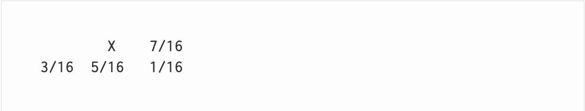

# 1920SchampheleerJorn

## Inleiding

Sedert lang speelt de grootte van afbeelding een belangrijke rol. Vroeger speelde dit vooral een rol door het gebrek aan RAM of opslagplaats voor de afbeelding.
Tegenwoordig vallen deze beperkingen minder zwaar maar zijn er nieuwe trends die een nood scheppen voor kleine afbeeldingen. 
Denk bijvoorbeeld aan de laadtijd van een website met meerdere afbeeldingen.
Naarmate beeldschermen hogere resoluties ondersteunden werd de nood voor kwalitatieve doch compacte afbeeldingen groter. 
Er moest dus een verandering komen en gezocht worden naar een optimale balans.
Het werken met kleurpaletten bleek een goede oplossing te zijn, deze techniek werd voor het eerst gebruikt in 1975 door Kajiya, Sutherland en Cheadle [[1](https://en.wikipedia.org/wiki/Indexed_color)].
Tot op heden blijft deze techniek een oplossing bij het reduceren van opslagruimte van een afbeelding. Het reduceren van kleuren door middel van een kleurenpallet bleek echter niet te volstaan.
Kleurenpaletten hadden moeite met het realistisch voorstellen van kleurovergangen. Dit is het moment waarop Dithering interessant werd. Deze techniek, waarvoor het idee ontstond tijdens WO2 [[2](https://en.wikipedia.org/wiki/Dither)], laat toe om een valse diepte in de afbeelding te brengen.
Gecombineerd vormen deze technieken een voldoend repertoire om afbeeldingen in grootte te beperken zonder essentiële informatie te verliezen.
Deze manier van opslaan wordt nog steeds gebruikt in het GIF [[3](https://en.wikipedia.org/wiki/GIF)] (Graphics Interchange Format) dat een palette van 256 kleuren toelaat voor gebruik in de afbeelding.
Bovenop het beperken van het aantal kleuren in de afbeelding wordt ook nog gebruik gemaakt van een lossless compressie.

## Wetenschappelijk onderzoek

### Color Quantization

Het reduceren van een 24bits afbeelding (16,777,215 kleuren) naar een palet noemt men Color Quantization of Color Depth Reduction. Dit proces zal de grootste invloed hebben op de kwaliteit van de bekomen afbeelding.
Om te spreken van kwaliteit is een definitie hiervan nodig. De best kwantificeerbare definitie voor kwaliteit berekent de gemiddelde kleurafstand van elke pixel in de bekomen afbeelding ten opzichte van de originele pixel.
Een hogere kwaliteit betekent dus een lagere gemiddelde kleurafstand. Er zijn vele algoritmen ter beschikking voor het reduceren van de kleuren in een afbeelding. Enkele voorbeelden zijn:

#### Eigen implementatie (Simple Quantizer)

Een eerste manier voor het opstellen van een palet gaat als volgt. Er van uit gaande dat elke pixel een waarde voor R, G en B bevat wordt van alle pixels de extrema bij gehouden.
Volgende waarden worden opgeslagen
 1. Max R
 2. Max G
 3. Max B
 4. Min R
 5. Min G
 6. Min B

Met deze waarden kan een balk worden voorgesteld in de RGB ruimte met oorsprong in (MinR, MinG, MinB) en gaande tot (MaxR, MaxG, MaxB).
Ten slotte wordt deze balk verdeeld in 256 kubussen. Wanneer men van deze kubussen op de hoekpunten de kleuren opslaat bekomt men een palet van 256 kleuren.

Voordelen:
 - Snel
 - Enkel extreme waarden hoeven opgeslagen te worden, niet alle kleuren hoeven bijgehouden te worden

Nadelen:
 - Bij het indelen in kubussen kan een kubus volledig leeg zijn, de kleur op deze hoekpunten zal dus niet gebruikt worden en is verloren.

Het veranderen van de originele kleur naar een paletkleur gaat via de formule van Pythagoras [[4](https://en.wikipedia.org/wiki/Euclidean_distance)]. Alle kleuren van het palet worden aanschouwd en de kleur die het dichts ligt in de RGB kleurenruimte bij de originele kleur wordt gekozen.

### Zwart Wit

De meest drastische vorm van Color Depth Reduction is bij overgang naar een palet met slechts 2 kleuren. De bekendste vorm is wellicht de omzetting van kleurenafbeeldingen naar zwart-wit afbeeldingen.
Het palet bestaat op dit moment uit 2 kleuren
 1. Zwart (0,0,0)
 2. Wit (255,255,255)

Voordelen:
 - Snel
 - Er hoeven maar 2 kleuren opgeslagen te worden

Nadelen:
 - Alle kleuren zijn verdwenen uit de afbeelding
 - Zonder dithering zullen regio's in de afbeelding uitgewassen lijken

Het veranderen van de originele kleur naar een paletkleur gaat opnieuw via de formule van Pythagoras

### HSL

Een andere manier voor het opstellen van het palet is om te werken met het HSL spectrum.
Uit het HSL spectrum [[5](https://en.wikipedia.org/wiki/HSL_and_HSV)] kan veel besloten worden. 
Als een afbeelding veel unieke Hue's bezit dan zal dit een kleurrijke afbeelding zijn en moeten er vooral verscheiden kleuren in het palet aanwezig zijn.
Als er vooral unieke Saturation waarden zijn dan zal dit een afbeelding zijn met vooral veel overgangen en moeten verschillende tinten van dezelfde kleur aanwezig zijn in het palet.
Als er vooral unieke Luminance waarden zijn dan zal dit een afbeelding met veel schaduwen en details zijn en zal in het palet hierop gefocust moeten worden.

Voordelen:
 - Houdt rekening met de specialisatie van de afbeelding

Nadelen:
 - Indien de afbeelding in zowel H, S en L veel unieke waarden heeft zal de gemiddelde kleurafstand toenemen

### Dithering [[2](https://en.wikipedia.org/wiki/Dither)]
Tijdens het quantization proces zullen op plaatsen waar kleur overgangen plaats vinden banden ontstaan. 
Deze banden ontstaan omdat het palet niet voldoende kleuren bezit om de overgang vlot te laten verlopen. 
Om dit tegen te gaan kan dithering toegepast worden. 
Dithering zal pixels in de overgang beïnvloeden zodat deze naar een andere palet kleur omgezet worden dan waar ze origineel naar zouden omgezet worden. 
Hierdoor zullen pixels niet eenduidig naar 1 kleur omgezet worden in een overgang en zal er geen band ontstaan. 
Logischerwijs zal dithering dus vooraf lopen aan quantization. 
Afbeeldingen die dithering ondergingen zullen een korrelig effect hebben. 
In een eerste indruk zou opvallen dat de gemiddelde kleurafstand door dithering vergroot. 
Dit zou volgens de definitie een afbeelding van lagere kwaliteit produceren. Het proces loopt echter anders. 
De definitie houdt enkel rekening met wat op het computerscherm wordt weergegeven. 
De menselijke ogen zullen echter pixel groepen waarnemen als een gemengde kleur. 
De menselijke ogen kunnen namelijk niet genoeg detail waarnemen. 
In theorie zou dithering dus op een computerscherm een hogere kleurafstand dan pure quantization halen, maar zou de waargenomen afbeelding een lagere kleurafstand hebben. 
Deze theorie geldt enkel wanneer de gebruiker ver genoeg van de waar te nemen afbeelding zit, zodat de ogen de pixelgroepen kunnen mengen. 
In praktijk zal dit echter niet altijd zijn en zal het post dithering effect waar te nemen zijn in de afbeelding. 
Er zijn verschillende mogelijkheden voor het toepassen van dithering.

#### Static en Random Dithering
Bij static en random dithering worden pixels aangepast zonder context. 
Het ditheren van een afbeelding op deze manier garandeert dus niet dat de waargenomen kleurafstand kleiner is dan de kleurafstand zonder dithering.
Bijgevolg zijn deze algoritmes niet veel gebruikt.

Voordelen:
 - Snel

Nadelen:
 - Geen gegarandeerde verbetering
 - Kan de kleurafstand drastisch slechter maken

#### Bayer Dithering (Ordered dithering) [[6](https://en.wikipedia.org/wiki/Ordered_dithering)]
Bayered dithering zal gebruik maken van een treshold map om pixels om te zetten. 
Deze manier zorgt er dus voor dat de pixels niet volledig random aangepast worden en is een verbetering ten opzichte van Static en Random dithering.

Voordelen:
 - Accurater dan Static en Random dithering

Nadelen:
 - Treshold map moet berekend worden (Processing power) of vooraf opgeslagen worden (RAM)
 - Houdt nog steeds weinig rekening met waargenomen kleurafstand

#### Error diffused dithering [[7](https://en.wikipedia.org/wiki/Error_diffusion)]
Error diffused dithering is de meest voorkomende vorm van dithering.
Deze vorm houdt van omgezette pixel de afstand bij tot zijn origineel (R1-R2, G1-G2, B1-B2).
De afstand die hierdoor bekomen wordt zal worden doorgegeven aan omliggende pixels.
De afstand zal met een factor bij de omliggende pixels opgeteld worden.
Hierdoor zullen deze omliggende pixels wanneer zij gequantizeerd worden frequent naar een andere kleur omgezet worden.
Doordat deze afstand zowel negatief als positief kan zijn, zullen dus afwisselende kleuren het resultaat zijn van de omzetting van dezelfde pixelwaarde.
Doordat afwisselend gewerkt zal worden zal ook de gemiddelde waargenomenkleurafstand kleiner worden.
Dit verklaart dan ook waarom deze manier het meest gebruikt wordt.
De bekendste vorm van Error diffused dithering is het Floyd-Steinberg algoritme [[8](https://en.wikipedia.org/wiki/Floyd–Steinberg_dithering)]
Dit algoritme zal de error vermenigvuldigen met een factor en verspreiden volgens volgende matrix.

Voordelen:
 - Accurate gemiddelde waargenomen kleurafstand
 - Meest natuurlijk aanvoelend

Nadelen:
 - Vergt meer processing power en kan niet vooraf berekend worden

## Opbouw van de code
De code is opgebouwd volgens het Dependency Injection patroon [[9](https://www.tutorialsteacher.com/ioc/dependency-injection)] en is vooral geconcentreerd in een Class Library.
De applicatie bevat ook verschillende lagen.
 - Logic: Hier bevindt zich de logica van de applicatie. Deze laag bevat bijvoorbeeld de ditherers en quantizers.
 - Presentation: Hier bevinden zich Drawer klassen. Dit zijn klassen die afbeeldingen (grafisch, vandaar presentatie laag) genereren door gebruik te maken van de logica laag.
 - Models: Hierin bevindt zich de Color klasse die gebruikt wordt voor berekeningen met kleuren waar de Color klasse van System.Drawing te kort schiet.
 - Util: Hier kunnen helper klassen gevonden worden zoals een Math klasse voor veelgebruikte wiskundige berekeningen (denk aan de kleurafstand).

Het project bevat ook een WindowsForms applicatie die een UI aanbiedt aan de gebruiker om eenvoudig te kunnen werken met de Class Library.
De Class Library bevat een centrale klasse. Dit is de ImageStore klasse. Deze klasse wordt gedefinieerd door een afbeelding, een quantizer en een ditherer.
De ImageStore klasse houdt informatie bij over een afbeelding. Ze berekent een histogram en vult de quantizer op met kleuren.
Een event wordt aangereikt aan andere klassen dat triggert wanneer het histogram en de quantizer klaar zijn.
Om tijd te besparen worden het histogram en de quantizer vanuit verschillende threads opgevuld.
Hier eindigt de job van de ImageStore. Deze verandert niets aan de afbeelding en houdt enkel de info bij.
Om quantization toe te passen op de afbeelding zal een nieuwe afbeelding getekend moeten worden.
Dit is de taak van een Drawer klasse. Verschillende drawer klassen worden aangereikt: met- en zonder dithering, synchroon en asynchroon.
Een drawer klasse wordt gedefinieerd door een ImageStore object.
De drawer klasse bevat verschillende methoden waarvan twee centraal staan.
Een methode om het histogram te visualiseren en een methode om een geditherede, gequantizeerde afbeelding te genereren.
Het genereren van de afbeelding gaat als volgt:
 1. Lees een pixel uit de originele afbeelding
 2. Kijk of dithering is toegepast op de huidige pixel
 3. Zoek de dichtstbijzijnde pixel in het palet en schrijf deze naar de te genereren afbeelding
 4. Bereken kleurafstand en pas dithering toe, dithering wordt opgeslagen in een overlay matrix
 5. Herhaal vanaf stap 1 voor de overige pixels

## Experimentatie
De applicatie laat voldoende ruimte tot experimentatie voor de eindgebruiker.
De eindgebruiker kan kiezen welke quantizer, ditherer en drawer gebruikt wordt voor het quantization proces.
Elke combinatie van voorgaande parameters kan de kwaliteit van de bekomen afbeelding alsook de snelheid van het berekenen veranderen.
Om een goed beeld te krijgen van welke invloed de verschillende parameters waarop hebben werden enkele experimenten opgesteld.
Enkel relevante experimenten en enkel relevante parameters van de experimenten zullen besproken worden.
### Vergelijken van Simple Quantizer met HSL Quantizer
In deze test is voornamelijk de kwaliteit van de bekomen afbeelding belangrijk.
Op vlak van RAM zal de Simple Quantizer het laagste verbruik kennen.
Dit omdat de HSL Quantizer alle kleuren van de afbeelding in een dictionary zal moeten bijhouden alvorens te kunnen selecteren op unieke waarden.
Als schaal voor de kwaliteit van de bekomen afbeelding hanteren we nog steeds de vooraf opgestelde definitie.

De HSL Quantizer komt als beste uit deze test.
Dit kan ook simpel beredeneerd worden.
De Simple Quantizer geeft geen garantie dat kleuren in het palet voorkomen in de originele afbeelding.
Hierdoor kan een grote afwijking ontstaan tussen de originele afbeelding en de gegenereerde afbeelding.
De HSL Quantizer, in tegenstelling, zal wel kleuren gebruiken in het palet die aanwezig zijn in de originele afbeelding.
Hierdoor kan deze Quantizer een gemiddeld lagere afstand garanderen.
### Vergelijken van Floyd Steinberg Ditherer met Jarvis Judice Ninke Ditherer
In deze test zullen verschillende criteria gehanteerd worden ter vergelijking.
De test zal uitgevoerd worden in combinatie met de BW quantizer omdat het effect van dithering het best zichtbaar is in een pallet met twee contrasterende kleuren.
De criteria zijn:
1. De witte oppervlakte zonder ditherpatroon in een afbeelding. 
   Onder normale omstandigheden zal bij zwart wit de kleurafstand steeds significant zijn.
   Indien er dus oppervlakten ontstaan zonder ditherpatroon zal dit wijzen op een slechte dither methode.
2. De overgang van dither patronen. 
   Hoe slechter de overgang van het ditherpatroon, des te duidelijker zal de randvorming bij quantization zijn. 
   Dit effect is het omgekeerde van wat het doel van dithering.

In deze testen is de beste ditherer op basis van onze criteria de Jarvis Judice Ninke Ditherer.
Deze zal een betere overgang teweeg brengen doordat de error diffusion gradueler is en over meer pixels verspreid wordt.
De afbeelding met Jarvis Judice Ninke Dithering heeft ook duidelijk de minst aaneensluitende witruimtes.
In theorie zou Floyd Steinberg sneller zijn doordat hier de diffused error gedeeld wordt door een macht van 2. 
Hierdoor kan bitshifting gebruikt worden wat sneller is dan integer of floating point operations.
In de praktijk werd in deze applicatie toch met floating points gewerkt om de dither distortion nauwkeuriger bij te houden.
Dit leverde een aanzienlijke verbetering op in het algoritme.
### Vergelijken van Synchronous Dithered Drawer met Asynchronous Dithered Drawer
In deze test zal vooral RAM verbruik en looptijd in kaart gebracht worden.
Het enige verschil tussen deze drawers is dat de Synchronous Dithered Drawer op een enkele thread uitgevoerd zal worden.
De Asynchronous Dithered Drawer zal echter elke rij van de afbeelding op een aparte thread laten uitvoeren.
Beide algoritmes zullen getest worden in combinatie met de HSL Quantizer en Floyd Steinberg Dithering.
Deze test zou even goed met andere parameters uitgevoerd kunnen worden.
De test zal uitgevoerd worden op een computer met een Intel i7 5820K met 6 cores, 12 threads, 4.2 Ghz clock speed en 16 GB ram
Resultaten kunnen afwijken op andere setups. 
Een computer met minder threads zal minder voordeel hebben bij de Asynchronous Dithered Drawer.
De Synchronous Dithered Drawer deed 4 minuten 27 seconden over een referentie 4K afbeelding met een RAM verbruik piek bij 332MB.
De Asynchronous Dithered Drawer deed 50 seconden over dezelfde referentie 4K afbeelding met een RAM verbruik piek bij 236MB.
## Besluit en kritische reflectie
De vraagstelling aan het begin was de mogelijkheid tot implementatie van een Color Quantization Algoritme dat kon exporteren naar GIF afbeeldingen.
Het besluit is dat dit zeker mogelijk is.
De applicatie is in staat een afbeelding te reduceren tot 256 kleuren en een beschaafde gemiddeld waargenomen kleurafstand te behouden.
Betere algoritmes voor quantisering zijn beschikbaar op het internet zoals het Xiaolin Wu algoritme [[10](https://people.freedesktop.org/~joonas/tmp/wu.pdf)].
Deze algoritmes zullen een lagere gemiddeld waargenomen kleurafstand bekomen maar vragen meer rekenkracht en RAM en zijn moeilijker te implementeren.
In de toekomst zou kunnen overwogen worden deze algoritmes toe te voegen aan de applicatie.
In de reflectie moet zeker ook gesproken worden over de snelheidstoename die bereikt is door asynchroon te werken.
De vergelijking van de Synchronous Dithered Drawer met de Asynchronous Dithered Drawer toont dat de Asynchronous Dithered Drawer het zelfde resultaat kan bekomen in 1/4 van de tijd.
Het resultaat is een afbeelding die gereduceerd is in grootte en die vanop een afstand geen verschillen vertoont met de originele afbeelding.

## Bronvermelding
 - [1][https://en.wikipedia.org/wiki/Indexed_color](https://en.wikipedia.org/wiki/Indexed_color)
 - [2][https://en.wikipedia.org/wiki/Dither](https://en.wikipedia.org/wiki/Dither)
 - [3][https://en.wikipedia.org/wiki/GIF](https://en.wikipedia.org/wiki/GIF)
 - [4][https://en.wikipedia.org/wiki/Euclidean_distance](https://en.wikipedia.org/wiki/Euclidean_distance)
 - [5][https://en.wikipedia.org/wiki/HSL_and_HSV](https://en.wikipedia.org/wiki/HSL_and_HSV)
 - [6][https://en.wikipedia.org/wiki/Ordered_dithering](https://en.wikipedia.org/wiki/Ordered_dithering)
 - [7][https://en.wikipedia.org/wiki/Error_diffusion](https://en.wikipedia.org/wiki/Error_diffusion)
 - [8][https://en.wikipedia.org/wiki/Floyd–Steinberg_dithering](https://en.wikipedia.org/wiki/Floyd–Steinberg_dithering)
 - [9][https://www.tutorialsteacher.com/ioc/dependency-injection](https://www.tutorialsteacher.com/ioc/dependency-injection)
 - [10][https://people.freedesktop.org/~joonas/tmp/wu.pdf](https://people.freedesktop.org/~joonas/tmp/wu.pdf)