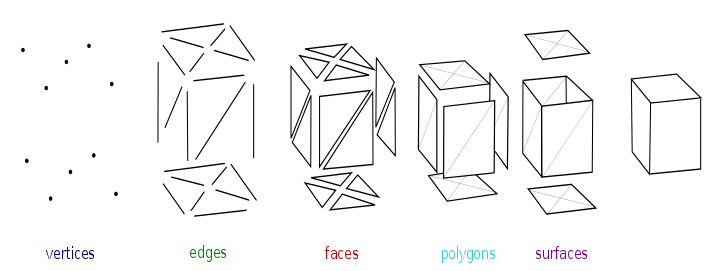
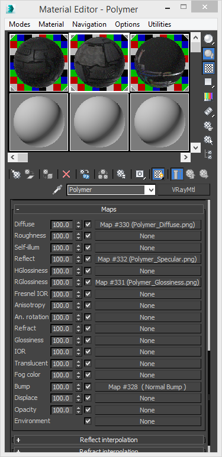
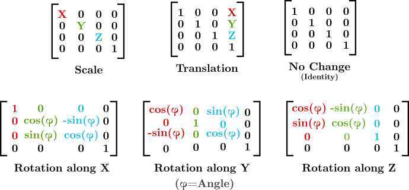
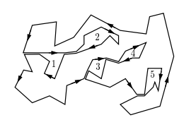
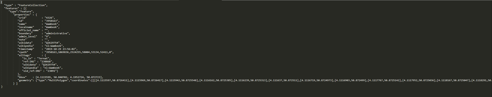
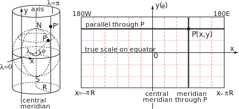
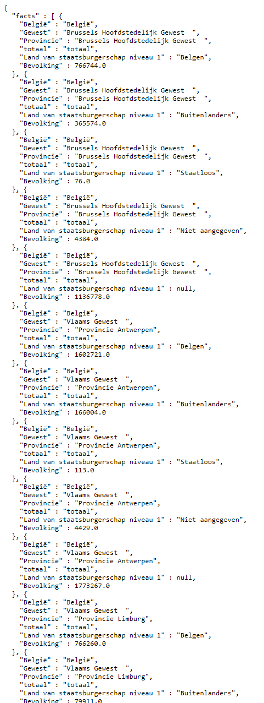

# 1920SchampheleerJorn

## Inleiding

In de moderne maatschappij speelt 3D een grote rol. 
Zelfs tot op vandaag wordt er nog gezocht naar manieren om onze 3D voorstellingen realistischer en beter te maken. 
Een voorbeeld is de RTX technologie die NVidia nog niet lang geleden uitbracht[[1]](https://www.youtube.com/watch?v=476N4KX8shA&feature=youtu.be).
Deze technologie zorgt dat RayTracing sneller kan berekend worden.
Deze technologie zorgt ervoor dat lichtinval beter en sneller berekend kan worden wat bijdraagt tot een veel realistischer beeld.
Het spectrum aan toepassingen van 3D is nog niet half gekend.
Toepassingen gaan van huizen modelleren bij bouwkundige toepassingen, 3D printen en organen visualiseren bij medische toepassingen tot games.
3D kan echter ook gebruikt worden voor datavisualisatie.
Dit document behandelt het visualiseren van data in 3D.
Er wordt een visualisatie gedaan van landsgrenzen op de X-as en Y-as en er wordt discrete data op de Z-as getoond.

## Wetenschappelijk onderzoek

### 3D Modellen

Om iets in 3D voor te stellen wordt een 3D model gebruikt.
Een 3D model is een lichaam dat zich bevindt in de 3D ruimte.
Het wordt voorgesteld door een verzameling van punten.
Deze punten kunnen verbonden worden door lijnen.
Wanneer meerdere punten via lijnen verbonden worden kan men een vlak bekomen.
Deze vlakken kunnen gebogen of recht zijn.
Op deze manier wordt het dus een grote veelhoek.
Een veelhoek leent zich echter niet tot animatie en het 3D model zou statisch zijn.
Het zou ook niet optimaal zijn om te renderen.
Zo goed als alle rendering engines zullen driehoeken gebruiken.
Dit omdat elk oppervlak kan opgedeeld worden in driehoeken en driehoeken enkel kunnen opgedeeld worden in driehoeken.[[2]](https://gamedev.stackexchange.com/a/9512)
Driehoeken zijn dus de meest primitieve oppervlakten in dit geval.
Er wordt dus een maas van driehoeken bekomen die in het Engels de term "Triangle Mesh" krijgt.

  
  

Een 3D model zal dus gerepresenteerd worden door een Triangle Mesh.

### Rendering

Rendering is het omzetten van een 3D ruimte naar een 2D afbeelding.
Dit is nodig om een ruimte te visualiseren op bijvoorbeeld een computerscherm.
Het renderproces maakt gebruik van wiskundige berekeningen om de transformatie uit te voeren.
Er wordt ook rekening gehouden met lichtinval, culling (objecten die buiten het frustum liggen) en clipping (objecten die gedeeltelijk in het frustum liggen opdelen om processing te verlichten).
Het frustum is het deel dat de camera ziet.
Bij het renderen moet steeds een camera in de ruimte aanwezig zijn.
De camera is vergelijkbaar met de ogen van de mens.
Alles wat buiten het frustum (gezichtsveld) van de camera ligt zal niet gerenderd worden (culling).
Bij het renderen moet ook rekening gehouden worden met Materials.
Een material is het materiaal van het object.
Een material kan bijvoorbeeld glanzend of dof zijn.
Een material kan ook kleur hebben of zelfs een texture.
Een texture is een afbeelding die op een 3D model geplakt kan worden.
Het material heeft geen invloed op de vorm van het model, maar op de manier waarop het model licht reflecteert.

    <figure>
        
        <figcaption>Different options for materials [[3]](https://www.turbosquid.com/3d-modeling/materials-texturing/)</figcaption>
    </figure>

### Wiskundig

Wiskundig is een ruimte nodig waarin het 3D model voorgesteld wordt.
Deze ruimte heeft dus 3 dimensies nodig.
De conventie is hiervoor een euclidisch assenstelsel te gebruiken.
De assen worden X, Y en Z genoemd maar hun oriëntatie verschilt.
Voor de manipulatie in deze ruimte van het 3D lichaam zal elk punt van het lichaam gemanipuleerd moeten worden.
Hiervoor worden 3 basistransformaties gebruikt. 
Deze kunnen voorgesteld worden door matrices.
Deze matrices kunnen ook samengesteld worden tot een enkele matrix.
De drie basistransformaties zijn translatie, rotatie en schaling.

    <figure>
        
        <figcaption>Matrix transformaties [[4]](http://sinestesia.co/wp/wp-content/uploads/2017/08/matrices_diagram.png)</figcaption>
    </figure>

Elke manipulatie van het 3D lichaam in de ruimte kan worden voorgesteld door deze transformaties.

### Point Reduction

Tijdens het renderen is snelheid steeds van uiterst belang.
Een goede balans tussen snelheid en kwaliteit moet gevonden worden afhankelijk van de toepassing.
Om snelheid te optimaliseren met een minimale impact op kwaliteit kan point reduction gebruikt worden.
Wanneer bijvoorbeeld uitgezoomd wordt op een afbeelding dan zullen sommige punten hoe ver ze ook in de ruimte van elkaar liggen op 1 pixel moeten getoond worden.
Om dit tegen te gaan kan bijvoorbeeld vertex cluster reduction gebruikt worden. 
Er zijn twee belangrijke soorten point reduction [[5]](http://geomalgorithms.com/a16-_decimate-1.html).

1. Vertex point reduction
    Deze manier van vertex reduction maakt gebruik van een radius.
    Beginnende bij de eerste vertex zal elke vertex binnen een radius $`\delta`$ verwijderd worden.
    Dan wordt naar de volgende overblijvende vertex gegaan en wordt het proces herhaald.
2. Ramer, Douglas Peucker reduction
    Bij RDP zal het begin met het einde van de sequentie van vertices verbonden worden.
    Wanneer het verste punt van deze lijn verder is dan een radius $`delta`$ zal het proces recursief gesplitst worden.
    Het eerste punt zal nu met dit verste punt verbonden worden en het verste punt met het laatste.
    Wanneer het verste punt dichter is dan een radius $`delta`$ dan kan deze sequentie dus vereenvoudigd worden door het eerste punt en het laatste.

### Polygon Triangulation

Niet alle modellen worden gemodelleerd met driehoeken.
Soms wordt ook gebruik gemaakt van vierkanten (quads in het Engels).
Veelhoeken met meer dan vier hoeken worden niet aangeraden (zie: [https://www.creativeshrimp.com/ngons-tutorial.html](https://www.creativeshrimp.com/ngons-tutorial.html))
Het proces dat een veelhoek onderverdeelt in driehoeken noemt men Polygon Triangulation.
Het is wiskundig bewezen dat elke veelhoek onderverdeeld kan worden in driehoeken.
Voor triangulation zijn enorm uiteenlopende algoritmes beschikbaar.
Het belangrijkste en meest gebruikte algoritme is Ear Clipping omdat dit gaten toelaat.
Dit algoritme steunt op het wiskundig feit dat elke veelhoek ten minste 1 'ear' bezit.
Een vertex pi is een ear als en slechts als de diagonaal gevormd door pi-1 en pi+1 volledig in de veelhoek ligt. [[6]](http://www-cgrl.cs.mcgill.ca/~godfried/teaching/cg-projects/97/Ian/introduction.html)
Dit ear is dus een driehoek die volledig in de veelhoek ligt. Wanneer we dit proces iteratief herhalen zal, aangezien elke veelhoek ten minste 1 'ear' bezit, uiteindelijk een driehoek overblijven.
Dit betekent dus dat de veelhoek volledig opgesplitst is in driehoeken.
Dezelfde strategie kan gebruikt worden wanneer een veelhoek met gaten gevonden wordt.
Voor een veelhoek met gaten wordt een brug gevormd van de polygon naar een gat. 
De brug loopt in beide richtingen.
Op deze manier wordt een grote polygon gevormd die onderhevig is aan het ear clipping theorema.

    

### GeoJson

GeoJson is een standaard voor het voorstellen van geografische data.
GeoJson is gebaseerd op de Javascript object notatie (JSON) standaard.
GeoJson begon zijn ontwikkeling in 2007. [[7]](https://en.wikipedia.org/wiki/GeoJSON)
GeoJson bevat definities voor "features".
Deze features kunnen steden, gemeentes, ... zijn.
Een feature bevat een geometrie.
Deze geometrie in GeoJson wordt voorgesteld door multipolygons, die op hun beurt worden voorgesteld door polygons die worden voorgesteld door linestrings.
Deze linestrings worden voorgesteld door punten op de aardbol.
De GeoJson bevat dus de omtrek van een landoppervlak alsook informatie over dit land.

    

### Geografische projecties

De aarde is een bol.
Om deze pol op een plat oppervlak te kunnen voorstellen is een projectie nodig.
Er zijn veel verschillende projecties die proberen de aarde zo accuraat mogelijk voor te stellen op een vlak.
Er zijn projecties die projecteren via een kegel, vlak en cilinder.
Er zijn projecties die afstanden bewaren, die richting bewaren en die oppervlakte bewaren.
De bekendste projectie is de Mercatorprojectie.
De Mercatorprojectie werd in 1569 uitgevonden door Gerardus Mercator.
De Mercatorprojectie is de standaard voor kaartprojectie bij navigatie omdat het een hoekgetrouwe projectie is. [[8]](https://nl.wikipedia.org/wiki/Mercatorprojectie)
Voor de projectie wordt gebruikt gemaakt van een cilinder.

    

### bestat.statbel.fgov.be

Deze website wordt onderhouden door de Belgische overheid.
Ze bevat data in verschillende formaten over allerlei onderwerpen.
Ze bestaat uit views.
Deze views bevatten info over een bepaald onderwerp.

    <figure>
        
        <figcaption>Een voorbeeld van de data van bestat.statbe.fgov.be</figcaption>
    </figure>

## Opbouw van de code

De code begint met het selecteren van een bestand.
Er moet dan een GeoJson bestand worden ingeladen.
Het programma begint dan met het verwerken van de data gevonden in het GeoJson bestand.
Er moet een 3D model gemaakt worden van de veelhoeken gevonden in het bestand.
Voor elke feature in het bestand (bijvoorbeeld provincie, land, ...) wordt een object aangemaakt van de klasse Area3D.
De klasse Visualizer zal ervoor zorgen dat elke feature terecht komt in een Area3D klasse.
Er wordt ook onmiddellijk een data provider meegegeven. Deze zal de data afhalen van de statbel API.
Deze data provider zal een "hoogte" geven aan de Area3D, een waarde langs de Z-as.
De Area3D zal eerst de veelhoeken die het kreeg onderwerpen aan een Point Reduction Algorithm, in dit geval Ramer-Douglas-Peucker.
Het zal ook de punten normaliseren. Dit houdt in dat het de Mercator projectie zal toepassen op alle punten, en zal zorgen dat alle oppervlakten gelijk geschaald zijn.
Hierna zal het een polygon opstellen door bidirectionele bruggen te trekken van de veelhoek naar zijn gaten.
Daarna zal het een ear clipping algoritme loslaten op de resulterende veelhoek.
De veelhoek is nu klaar om in 3D opgesteld te worden.
Er zal een triangle mesh opgesteld worden. 
Voor de onderkant zal de bekomen veelhoek met de driehoeken van het ear clipping algoritme en Z-waarden op 0 gebruikt worden.
De bovenkant zal op dezelfde wijze opgesteld worden maar hier wordt als Z-waarde de waarde van de data provider gebruikt, hierdoor zal elke Area3D dus een andere hoogte hebben.
Om een waarde te bekomen van de data provider zal de Visualizer de naam van de Area3D geven aan de data provider, deze zal dan op zijn beurt kijken of hiervoor een entry in de View gevonden wordt.
Er resten nu enkel nog de zijkanten.
Elke 2 punten van de onderkant maken samen met hun respectievelijke punten van de bovenkant een rechthoek.
Een rechthoek bestaat uit 2 driehoeken. 
Om de zijkanten te bekomen volstaat het dus deze 2 driehoeken toe te voegen aan de mesh voor elke 2 punten van de onderkant.
Wanneer alle Area3D's klaar zijn zal aan elke Area3D een kleur worden toegewezen om duidelijk te maken welke delen bij elkaar horen.
Tot slot wordt de scene opgesteld.
Er worden lichten toegevoegd, de modellen worden geschaald en verplaatst om goed in de scene te passen en er wordt een legende-overlay over de scene getekend.
Deze legende laat ook toe om Area's te verbergen, het materiaal van de modellen aan te passen en om een referentievlak toe te voegen.

## Experimentatie

